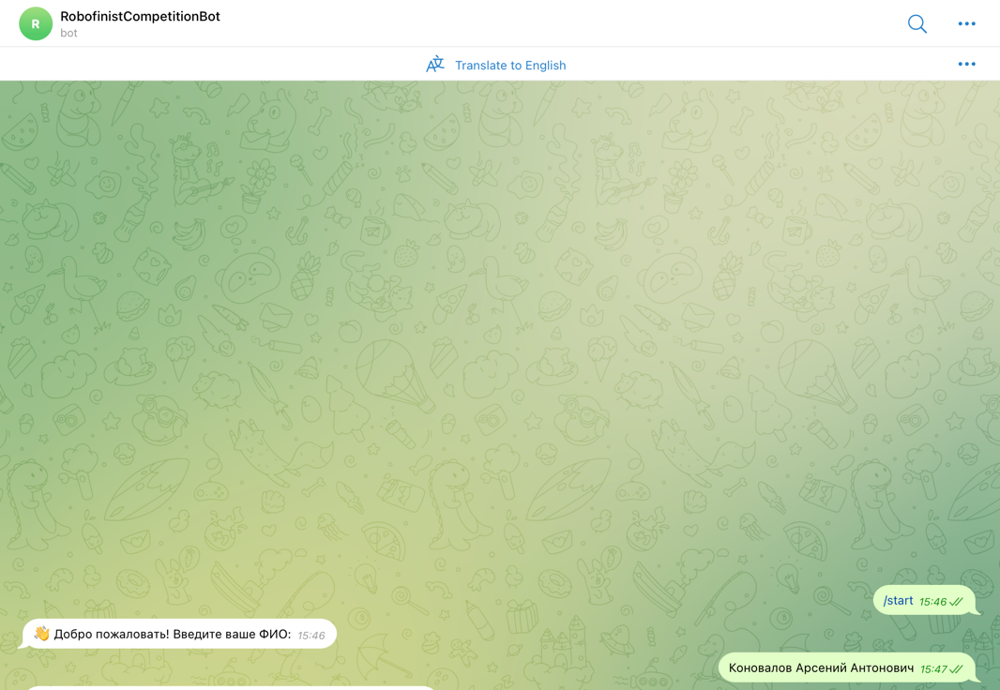
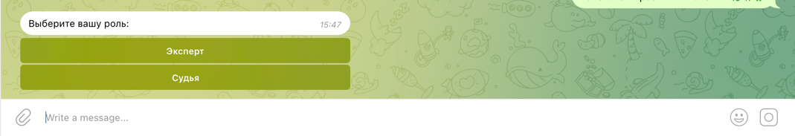
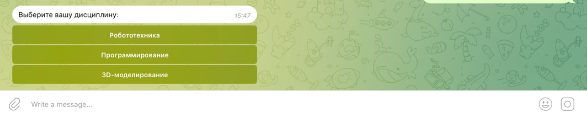
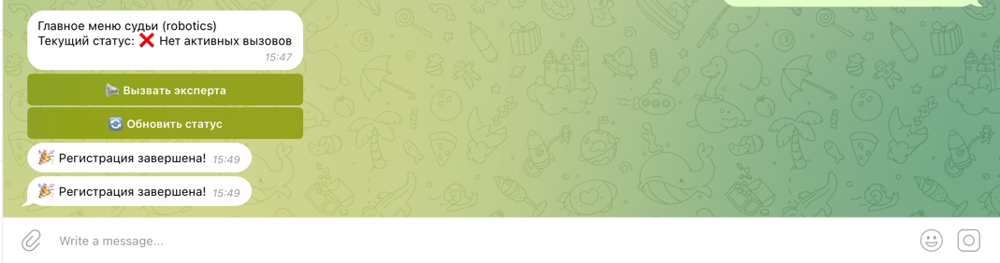
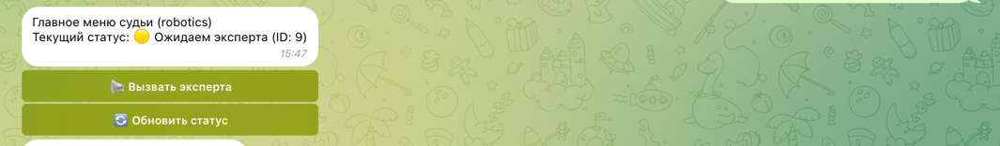
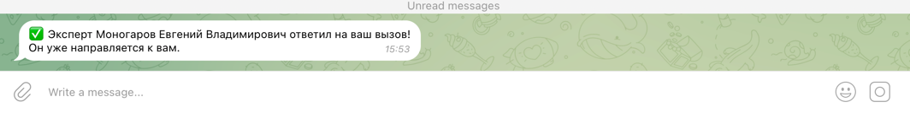
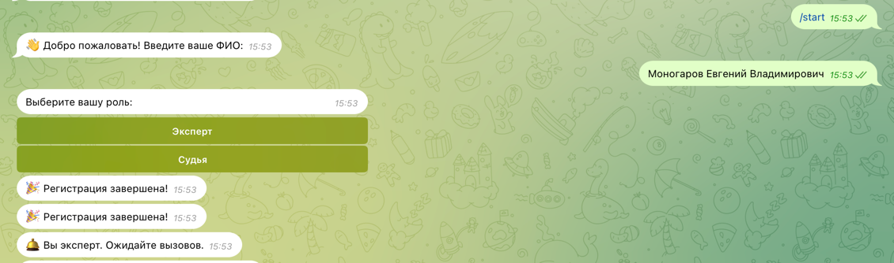
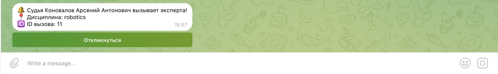
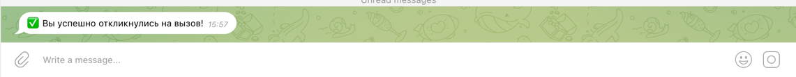

***Инструкция по использованию бота***

---------

**Для судей:**

Перед началом использования Вам нужно зарегистрироваться в боте 

Для этого перейдите в бота [@rb_competition_bot](https://t.me/rb_competition_bot) и пропишите команду **/start**

Далее нажмите на появившуюся кнопку **судья**

Выберите **дициплину**, которую будете судить

Поздравляю, вы зарегистрировались в системе!

Теперь вы можете **Вызвать эксперта**. Для этого, нужно нажать на соответствующую кнопку:

Статус вызова обновляется динамически. Если у вас произошло "подвисание" сети или устройства, то лучше нажмите кнопку "Обновить статус"

Как только эксперт увидит, что Вы его вызвали - Вы получите уведомление

---

**Для экспертов**

Перед началом использования Вам нужно зарегистрироваться в боте 

Для этого перейдите в бота [@rb_competition_bot](https://t.me/rb_competition_bot) и пропишите команду **/start**

Далее нажмите на появившуюся кнопку **судья**

Выберите **дициплину**, которую будете судить

Поздравляю, вы зарегистрировались в системе!

Как только судья вызовет эксперта Вы получите уведомление

Нажмите на кнопку **Откликнуться** и идите к нужному месту

---

**Поддержка**:

При возникновении проблем обращайтесь в телеграм
[@clxseyxureyes](https://t.me/clxseyxureyes)

